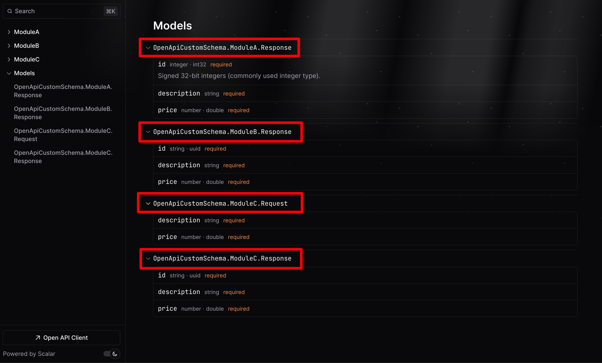

# Enabling OpenAPI Spec to Use Full Type Names for Nested Types

In this post, we'll walk through the steps to enable the .NET 9 OpenAPI Spec to use full type names for nested types in your ASP.NET Core application.

## The good'ol days

Previously in .NET 8 with Swashbuckle Swagger/NSwag we could use the `CustomSchemaIds` extension method and provide a transformation delegate to support fully qualified type names for nested types in the schema. Here is the original suggestion (as far as I can tell) on GitHub: https://github.com/swagger-api/swagger-ui/issues/7911#issuecomment-1068538276)

Essentially, all we are trying to achieve is to replace the `+` notation that prefixes the parent class name to the nested class name with the `.` notation to obtain a display friendly fully qualified type name.

```csharp
setup.CustomSchemaIds(x => x.FullName?.Replace("+", ".", StringComparison.Ordinal));
```

## Now that the future is here

In .NET 9, Swashbuckle has been removed as the default and replaced with a new .NET native implementation for [OpenAPI specification document generation](https://learn.microsoft.com/en-au/aspnet/core/fundamentals/openapi/overview?view=aspnetcore-9.0). However, now there is no convenient way to achieve the same outcome as we had using that Swashbuckle extension method.

Before diving into the solution, there are some default behaviours to be aware of in the new .NET 9 OpenAPI generated document. 

* First, I noticed that for any exactly similarly structured nested types the new schema only displays a single Model entry (as in there are no duplicates). 
* Second, if you have nested types with the same name but different structures, then a numbered suffix is added to the typename in the schema.


*Figure: Scalar UI showing basic model names with numbered suffixes*


*Figure: Scalar UI not showing any model names, just the object schema*

Neither of these behaviours is what I am looking for. Also, when expanding the endpoint to inspect the body or response schemas, there are no type names displayed either. Without the full type name, I cannot tell exactly which model the UI is referring to in my codebase. I NEED THE FULL TYPE NAME!!

So, after a bit of experimentation I got my own version of the beloved `CustomSchemaIds` implementation working. The next section will cover all the details of the implementation.


*Figure: Expanding the response schema now shows the full type name*


*Figure: The Models section now shows the full type name - no ambiguity!*

Finally! The schema is showing me everything I need.

Now lets look at how the extension method works and how you can use it in your own applications.

## How to transform the OpenAPI schema types

I created this extension method to modify the OpenAPI schema generation process by allowing type names to be transformed using a delegate method. So you can modify the type names however you see fit.

Here is the all the code for the extension method:

```csharp
using Microsoft.AspNetCore.OpenApi;

public static class OpenApiExtensions
{
    public static OpenApiOptions CustomSchemaIds(this OpenApiOptions config, Func<Type, string?> typeSchemaTransformer, bool includeValueTypes = false)
    {
        return config.AddSchemaTransformer((schema, context, _) =>
        {
            // Skip value types and strings
            if (!includeValueTypes && 
                (context.JsonTypeInfo.Type.IsValueType || 
                 context.JsonTypeInfo.Type == typeof(String) || 
                 context.JsonTypeInfo.Type == typeof(string)))
            {
                return Task.CompletedTask;
            }

            // Skip if the schema ID is not already set because we don't want to decorate the schema multiple times
            if (schema.Annotations == null || !schema.Annotations.TryGetValue("x-schema-id", out object? _))
            {
                return Task.CompletedTask;
            }
                    
            // transform the typename based on the provided delegate
            string? transformedTypeName = typeSchemaTransformer(context.JsonTypeInfo.Type);

            // Scalar - decorate the models section
            schema.Annotations["x-schema-id"] = transformedTypeName;

            // Swagger and Scalar specific:
            // for Scalar - decorate the endpoint section
            // for Swagger - decorate the endpoint and model sections
            schema.Title = transformedTypeName;

            return Task.CompletedTask;
        });
    }
}
```

* The `CustomSchemaIds` method adds a schema transformer to the OpenAPI configuration by calling `AddSchemaTransformer` and receives a delegate `typeSchemaTransformer` that callers can use for the custom transformation of types.
* This transformer is a function that takes three parameters: `schema`, `context`, and `cancellationToken`. We are mainly interested in the `schema`, and the current `context` objects to perform our transformations.
* The function first checks if the type information (`context.JsonTypeInfo.Type`) is a `value type` or a `string`.
    * If it is, the function returns immediately using `Task.CompletedTask`, indicating that no transformation is needed for these types - I like to keep them as simple as possible.

    > FYI - if we fully qualify `value types` then they appear as `System.Double`, `System.Guid`, `System.Int32`, `System.String` instead of `decimal`, `guid`, `int`, `string` :(

* Next, the function checks if the `schema.Annotations` dictionary is null or does not contain the `x-schema-id` key.
    * If either condition is true, the function again returns `Task.CompletedTask`, as there is no schema ID to modify.
    * If the schema ID is present, the function updates the `x-schema-id` annotation and the `schema.Title` property with the transformed type name.
* The transformed type name is obtained by executing the provided `typeSchemaTransformer` delegate and passing the `context.JsonTypeInfo.Type` value to be transformed.

I did have to take a bit of care to make it work for both [SwaggerUI](https://swagger.io/tools/swaggerhub/) and the newer [Scalar UI](https://github.com/scalar/scalar). Both libraries interpret the OpenAPI spec document slightly differently. 

* SwaggerUI uses the `title` field from the schema to represent the type name throughout the UI
* Scalar uses the `title` field from the schema to represent the type in the **endpoints** section of the UI 
* Scalar uses the `x-schema-id` annotation to represent the type in the **models** section of the UI 

With this extension method, I managed to achieve a consistent outcome for both SwaggerUI and Scalar.

Nice and simple!

Now lets look at using this extension method in our own applications.

## Custom Schema Transformations

In your `Program.cs` file, use the extension method above as part of your OpenAPI application services configuration:

```csharp
var builder = WebApplication.CreateBuilder(args);

// Add OpenAPI spec generation using the AddOpenApi extension method
builder.Services.AddOpenApi(config => 
{
    //
    // with .NET 9 OpenApi, to support fully qualified type names for nested types in the schema, use the
    // CustomSchemaIds extension method (but from our own extension method :) )
    //
    config.CustomSchemaIds(x => x.FullName?.Replace("+", ".", StringComparison.Ordinal));
});

var app = builder.Build();
```

In my case I use the `CustomSchemaIds` extention method to transform the context type to nicely display as a fully qualified type name (e.g. `namespace.classname`, `namespace.classname.nestedclassname`). This transformation ensures that both the model and endpoint sections of the OpenAPI documentation use fully qualified type names. I find that it simply enhances the clarity and specificity of the generated API documentation when using nested types.

## Add some UI middleware to render your OpenAPI document

In your `Program.cs` file, configure the OpenAPI middleware with your specific route, as well as configuring Swagger UI and Scalar UI to read the OpenAPI doc at the specific route.

(I went a bit furhter and customised both UIs with my own flare)

```csharp
WebApplication app = builder.Build();

app.UseHttpsRedirection();

// Map an endpoint for viewing the OpenAPI document in JSON format
// Link: https://localhost:7009/openapi/v1.json
const string documentName = "v1";
app.MapOpenApi("/openapi/{documentName}.json");
        
// Map an endpoint for viewing the OpenAPI document in via the Scalar UI
// Link: https://localhost:7009/scalar
app.MapScalarApiReference(o =>
{
    o.WithTheme(ScalarTheme.DeepSpace)
        .WithModels(true)
        .WithSidebar(true)
        .WithLayout(ScalarLayout.Modern)
        .WithClientButton(true)
        .WithOperationSorter(OperationSorter.Method)
        .WithDotNetFlag(true)
        .OpenApiRoutePattern = "/openapi/{documentName}.json";
});
 
// Map an endpoint for viewing the OpenAPI document in via the Swagger UI
// Link: https://localhost:7009/swagger
app.UseSwaggerUI(
    Theme.UniversalDark,
    setupAction: options =>
    {
        options.RoutePrefix = "swagger";
        options.SwaggerEndpoint($"/openapi/{documentName}.json", documentName);
    });
```

Next, in your `Program.cs`, add some basic API endpoints:

```csharp
app.MapGet("/api1", ModuleA.Execute)
    .WithName("GetSomethingFromModuleA");

app.MapGet("/api2", ModuleB.Execute)
    .WithName("GetSomethingFromModuleB");

app.MapPost("/api3", ModuleC.Execute )
    .WithName("AddSomethingToModuleC");
```

Define the modules that contain the module specific route handlers:

```csharp
// ModuleA.cs

internal static class ModuleA
{
    public record Response(int Id, string Description, double Price);

    public static async Task<Results<Ok<Response>, NotFound<int>>> Execute(int id)
    {
        var resp = new Response(1, "Thing from Module A", 100.0);
        return await Task.FromResult(TypedResults.Ok(resp));
    }
}
```

```csharp
// ModuleB.cs
internal static class ModuleB
{
    public record Response(Guid Id, string Description, double Price);

    public static async Task<Results<Ok<Response>, NotFound<int>>> Execute(int id)
    {
        var resp = new Response(Guid.NewGuid(), "Thing from Module B", 200.0);
        return await Task.FromResult(TypedResults.Ok(resp));
    }
}
```

```csharp
// ModuleC.cs
internal static class ModuleC
{
    public record Request(string Description, double Price);

    public record Response(Guid Id, string Description, double Price);

    public static async Task<Results<Ok<Response>, NotFound<int>>> Execute(Request request)
    {
        var resp = new Response(Guid.NewGuid(), request.Description, request.Price);
        return await Task.FromResult(TypedResults.Ok(resp));
    }
}
```

Now that you have everything in place, run the application and navigate to one of the UI routes:

* https://localhost:7009/swagger
* https://localhost:7009/scalar

Notice that we now have the nested types nicely displayed without any ambiguity :)

That is all. I hope you enjoy using this neat little extension to make your API docs easier to read!

Check out the [full source code](https://github.com/william-liebenberg/OpenApi-FullTypeNames) on my GitHub.
